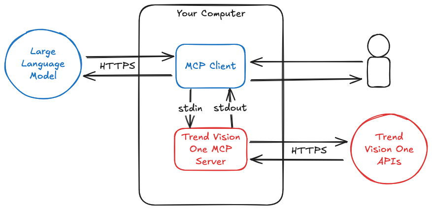
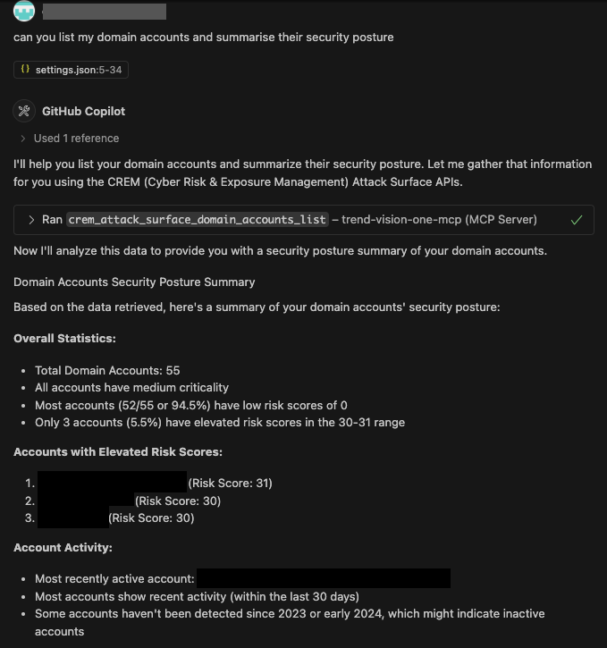
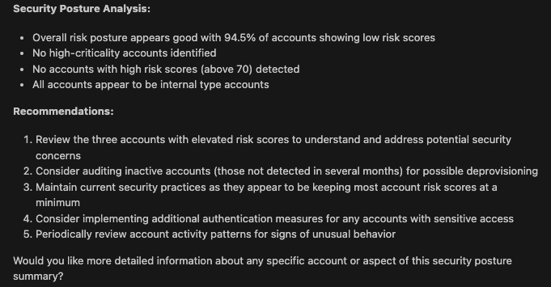
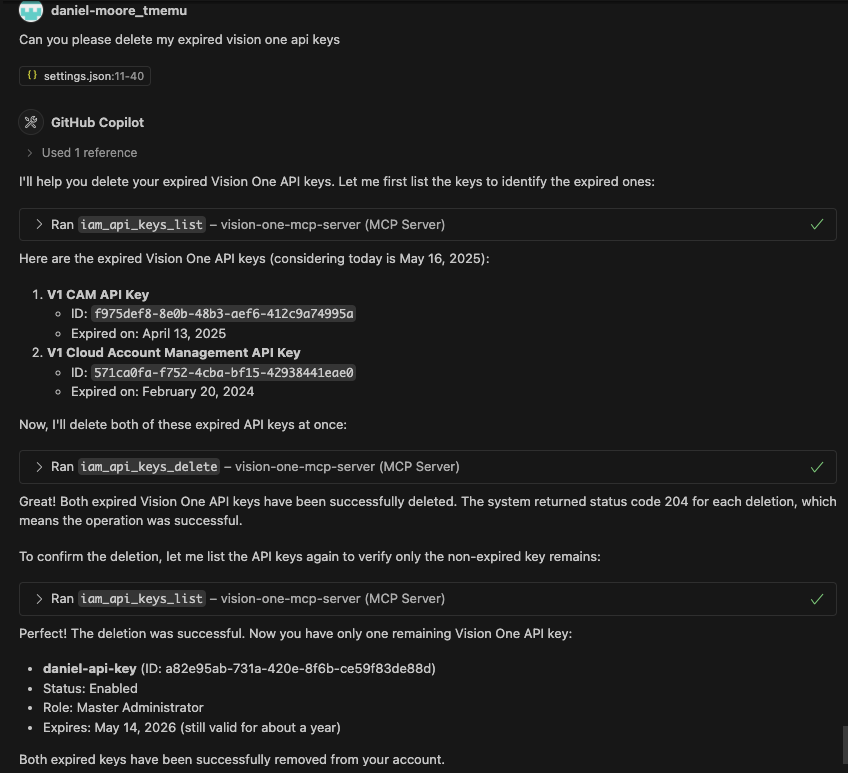
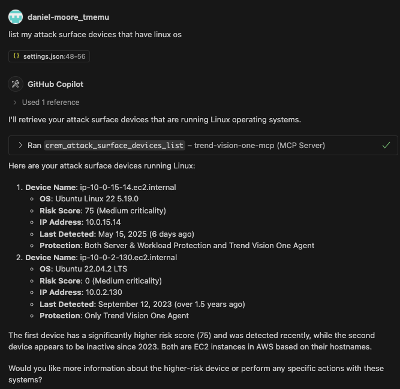

# Trend Vision One MCP Server

The Trend Vision One Model Context Protocol (MCP) Server enables natural language interaction between your favourite AI tooling and the Trend Vision One web APIs.

This allows users to harness the power of Large Language Models (LLM) to interpret and respond to security events.

## Example Use Cases

1. Automating the retrieval and interpretation of security alerts from various Trend Vision One such tools as Workbench, Cloud Risk Management, and File Security.
2. Allowing LLMs to gather information about security events and generate meaningful recommendations.
3. Automating workflows to enhance the configuration of Trend Vision One services.
4. Interacting with Trend Vision One web APIs without having to learn yet another company's APIs.

## Security

1. Your Trend Vision One API keys should be configured with minimial permissions.
2. By default the MCP server runs in read-only mode. Be careful when running the server with `readonly=false` as it may have irreversible consequences.
3. Data retrieved using the MCP server is processed by the LLM configured in your AI tooling. It is your responsibility to ensure that this LLM is approved by your company for processing sensitive data.
4. This MCP server is only intended to be used with local integrations and command-line tools via the Standard Input/Output transport. You should never expose this tool to the network.

## Getting Started

### Prerequisites

1. You must have a Trend Vision One account and API key.
2. You must have credits allocated for the services you wish to interact with.
3. Have [Docker](https://www.docker.com/) installed.
4. Have the latest version of [Visual Studio Code](https://code.visualstudio.com/) installed.

### Use With VSCode + GitHub Copilot

Open the following link in your browser to automatically install the server configuration in Visual Studio Code.

```text
vscode:mcp/install?%7B%22name%22%3A%22trend-vision-one-mcp%22%2C%22inputs%22%3A%5B%7B%22type%22%3A%22promptString%22%2C%22id%22%3A%22trend-vision-one-api-key%22%2C%22description%22%3A%22Trend%20Vision%20One%20API%20Key%22%2C%22password%22%3Atrue%7D%2C%7B%22type%22%3A%22promptString%22%2C%22id%22%3A%22trend-vision-one-region%22%2C%22description%22%3A%22Trend%20Vision%20One%20Region%22%7D%5D%2C%22command%22%3A%22docker%22%2C%22args%22%3A%5B%22run%22%2C%22-i%22%2C%22--rm%22%2C%22-e%22%2C%22TREND_VISION_ONE_API_KEY%22%2C%22ghcr.io%2Ftrendmicro%2Fvision-one-mcp-server%22%2C%22-region%22%2C%22%24%7Binput%3Atrend-vision-one-region%7D%22%2C%22-readonly%3Dtrue%22%5D%2C%22env%22%3A%7B%22TREND_VISION_ONE_API_KEY%22%3A%22%24%7Binput%3Atrend-vision-one-api-key%7D%22%7D%7D
```

When prompted, enter your Vision One API Key and your Vision One region.

Alternatively, copy the following into your `settings.json`.

```json
{
    "mcp": {
        "inputs": [
            {
                "type": "promptString",
                "id": "trend-vision-one-api-key",
                "description": "Trend Vision One API Key",
                "password": true
            },
            {
                "type": "promptString",
                "id": "trend-vision-one-region",
                "description": "Trend Vision One Region"
            }
        ],
        "servers": {
            "trend-vision-one-mcp": {
                "command": "docker",
                "args": [
                    "run",
                    "-i",
                    "--rm",
                    "-e",
                    "TREND_VISION_ONE_API_KEY",
                    "ghcr.io/trendmicro/vision-one-mcp-server",
                    "-region",
                    "${input:trend-vision-one-region}",
                    "-readonly=true"
                ],
                "env": {
                    "TREND_VISION_ONE_API_KEY": "${input:trend-vision-one-api-key}"
                }
            }
        }
    },
}
```

### Server Options

| Option | Description |
| ------ | ----------- |
| `-readonly` | Specify whether or not the server should run in readonly mode `readonly=true`, `readonly=false`. Default `true`. |
| `-region` | Specify the Trend Vision One region. Regions are: `au`, `ca`, `eu`, `id`, `in`, `jp`, `mea`, `sg`, `uk`, `us` or `za`. |
| `-toolsets` | Comma separated list of toolsets to enable, or `all`. Default `all`. Available toolsets: `ai`, `audit`, `awareness`, `business`, `cam`, `cases`, `cloudrisk`, `container`, `crem`, `datalake`, `dmm`, `eiqs`, `email`, `endpoint`, `filesecurity`, `healthcheck`, `iam`, `playbooks`, `response`, `sandbox`, `search`, `tags`, `threatintel`, `workbench` (includes OAT). Write tools of a selected toolset are still only registered when `-readonly=false`. |
| `-host` | Set the Trend Vision One endpoint you want to use. Useful for interacting with internal environments. |

## Tools

### Identity and Access Management (IAM)

| Tool | Description | Mode |
| ---- | ----------- | ---- |
| `iam_api_keys_list` | List Vision One API Keys. | `read` |
| `iam_api_keys_delete` | Delete Vision One API Keys. | `write` |
| `iam_accounts_list` | Displays users, groups, and invitations in the account. | `read` |
| `iam_account_invite` | Sends an invitation to the specified email address to be added as an account. | `write` |
| `iam_account_update` | Updates the specified account. | `write` |
| `iam_account_delete` | Deletes the specified account. | `write` |
| `iam_account_get` | Retrieve details of a user account, SAML group, or invitation. | `read` |
| `iam_api_keys_create` | Create API Keys. | `write` |
| `iam_api_key_get` | Get API key. | `read` |
| `iam_api_key_update` | Update API key. | `write` |
| `iam_identity_providers_list` | List SAML identity providers. | `read` |
| `iam_identity_providers_create` | Add a SAML identity provider. | `write` |
| `iam_identity_provider_delete` | Delete a SAML identity provider. | `write` |
| `iam_identity_provider_get` | Retrieve SAML identity provider details. | `read` |
| `iam_identity_provider_update` | Update a SAML identity provider. | `write` |
| `iam_roles_list` | List user roles. | `read` |
| `iam_roles_create` | Create user role. | `write` |
| `iam_roles_permission_keys_list` | Get all available permission keys. | `read` |
| `iam_role_delete` | Delete user role. | `write` |
| `iam_role_get` | Get user role. | `read` |
| `iam_role_update` | Update user role. | `write` |
| `iam_role_permissions_list` | Get permissions of a specific role. | `read` |

### Workbench

| Tool | Description | Mode |
| ---- | ----------- | ---- |
| `workbench_alerts_list` | List Trend Vision One Workbench Alerts. | `read` |
| `workbench_alert_detail_get` | Displays information about the specified alert. | `read` |
| `workbench_observed_attack_techniques_list` | List observed attack techniques. | `read` |
| `oat_data_pipelines_list` | Get active data pipelines. | `read` |
| `oat_data_pipelines_create` | Registers a customer to the Observed Attack Techniques data pipeline. | `write` |
| `oat_data_pipelines_delete` | Unregister from data pipeline. | `write` |
| `oat_data_pipeline_get` | Get pipeline settings. | `read` |
| `oat_data_pipeline_update` | Modify data pipeline settings. | `write` |
| `oat_data_pipeline_packages_list` | Get Observed Attack Techniques event packages. | `read` |
| `oat_data_pipeline_package_get` | Get Observed Attack Techniques package. | `read` |
| `workbench_alert_notes_create` | Add alert note. | `write` |
| `workbench_alert_notes_delete` | Delete alert notes. | `write` |
| `workbench_alert_note_get` | Get alert note. | `read` |
| `workbench_alert_note_update` | Edit alert note. | `write` |
| `workbench_alert_update` | Modify alert status. | `write` |
| `workbench_insights_list` | Get insights list. | `read` |
| `workbench_insight_get` | Get insight details. | `read` |
| `workbench_insight_impact_scope_entities_list` | Get insight details (impact scope). | `read` |
| `workbench_insight_indicators_list` | Get insight details (indicators). | `read` |
| `workbench_insight_matched_highlights_list` | Get insight details (matched highlights). | `read` |

### Cyber Risk & Exposure Management (CREM)

| Tool | Description | Mode |
| ---- | ----------- | ---- |
| `crem_attack_surface_devices_list` | List discovered attack surface devices. | `read` |
| `crem_attack_surface_domain_accounts_list` | List discovered attack surface domain accounts. | `read` |
| `crem_attack_surface_service_accounts_list` | List discovered service accounts. | `read` |
| `crem_attack_surface_global_fqdns_list` | List discovered internet facing domains (Fully Qualified Domain Names). | `read` |
| `crem_attack_surface_public_ips_list` | List discovered public IP addresses. | `read` |
| `crem_attack_surface_cloud_assets_list` | List discovered cloud assets. | `read` |
| `crem_attack_surface_high_risk_users_list` | List high risk users. | `read` |
| `crem_attack_surface_cloud_asset_profile_get` | Get a cloud asset's profile. | `read` |
| `crem_attack_surface_cloud_asset_risk_indicators_list` | List a cloud asset's risk indicators. | `read` |
| `crem_attack_surface_local_apps_list` | List discovered local applications. | `read` |
| `crem_attack_surface_local_app_profile_get` | Get a local app's profile. | `read` |
| `crem_attack_surface_local_app_risk_indicators_list` | List a local app's risk indicators. | `read` |
| `crem_attack_surface_local_app_devices_list` | Displays the devices with the specified local application installed. | `read` |
| `crem_attack_surface_local_app_executable_files_list` | Displays the local applications installed executable files. | `read` |
| `crem_attack_surface_custom_tags_list` | List tag definitions. | `read` |
| `crem_account_compromise_event_definitions_list` | Get risk event definitions. | `read` |
| `crem_account_compromise_indicators_list` | Get account compromise indicators. | `read` |
| `crem_account_compromise_risk_indicator_events_list` | Get account compromise risk events with summary information. | `read` |
| `crem_account_compromise_risk_indicator_event_get` | Get the detailed information of the specified account compromise risk event. | `read` |
| `crem_anomaly_detection_risk_indicator_events_list` | Get activity and behaviors risk events with summary information. | `read` |
| `crem_anomaly_detection_risk_indicator_event_get` | Get the detailed information of the specified activity and behaviors risk event. | `read` |
| `crem_asset_groups_list` | Get cyber risk subindexes of asset group data. | `read` |
| `crem_attack_surface_assets_update_criticality` | Batch update asset criticality. | `write` |
| `crem_attack_surface_cloud_assets_update` | Update cloud asset tags. | `write` |
| `crem_attack_surface_devices_update` | Update device tags. | `write` |
| `crem_cloud_vm_vulnerabilities_list` | Get vulnerabilities in cloud VMs. | `read` |
| `crem_container_vulnerabilities_list` | Get CVEs in containers. | `read` |
| `crem_high_risk_devices_list` | Get at-risk devices list. | `read` |
| `crem_high_risk_device_get` | Get device risk profile. | `read` |
| `crem_high_risk_user_get` | Get user risk profile. | `read` |
| `crem_internal_asset_vulnerabilities_list` | Get CVEs in internal assets. | `read` |
| `crem_internet_facing_asset_vulnerabilities_list` | Get CVEs in internet-facing assets. | `read` |
| `crem_security_posture_get` | Get security posture data. | `read` |
| `crem_serverless_function_vulnerabilities_list` | Get vulnerabilities in serverless functions. | `read` |
| `crem_vulnerability_get` | Get basic CVE information. | `read` |
| `crem_vulnerability_affected_cloud_storage_assets_list` | Get cloud storage affected by CVEs. | `read` |
| `crem_vulnerability_affected_cloud_vms_list` | Get cloud VMs affected by CVEs. | `read` |
| `crem_vulnerability_affected_container_clusters_list` | Get container clusters affected by CVEs. | `read` |
| `crem_vulnerability_affected_container_images_list` | Get container images affected by CVEs. | `read` |
| `crem_vulnerability_affected_devices_list` | Get devices affected by CVEs. | `read` |
| `crem_vulnerability_affected_global_fqdns_list` | Get FQDNs affected by CVEs. | `read` |
| `crem_vulnerability_affected_serverless_function_layers_list` | Get serverless function layers affected by CVEs. | `read` |
| `crem_vulnerability_affected_serverless_functions_list` | Get serverless functions affected by CVEs. | `read` |
| `crem_vulnerable_devices_list` | Get CVEs detected in a device. | `read` |

### Cloud Account Management (CAM)

| Tool | Description | Mode |
| ---- | ----------- | ---- |
| `cam_alibaba_account_get` | Get the details of an Alibaba account managed by Cloud Account Manangement. | `read` |
| `cam_alibaba_accounts_list` | Displays all Alibaba Cloud accounts connected to Trend Vision One in a paginated list. | `read` |
| `cam_aws_accounts_list` | List AWS accounts managed by Cloud Account Management. | `read` |
| `cam_aws_account_get` | Get the details of an AWS account managed by Cloud Account Management. | `read` |
| `cam_gcp_accounts_list` | List Google Cloud Projects managed by Cloud Account Management. | `read` |
| `cam_gcp_account_get` | Get the details of a GCP project managed by Cloud Account Manangement. | `read` |
| `cam_alibaba_accounts_create` | Add Alibaba Cloud account. | `write` |
| `cam_alibaba_accounts_generate_terraform_package` | Get Alibaba Cloud Terraform template. | `read` |
| `cam_alibaba_account_delete` | Remove Alibaba Cloud account. | `write` |
| `cam_alibaba_account_update` | Modify Alibaba Cloud account details. | `write` |
| `cam_aws_accounts_create` | Add an account. | `write` |
| `cam_aws_accounts_features_list` | Get feature list. | `read` |
| `cam_aws_accounts_generate_cfn_template_links` | Generate AWS CloudFormation template. | `read` |
| `cam_aws_accounts_generate_terraform_package` | Generate AWS Terraform template. | `read` |
| `cam_aws_account_delete` | Remove account. | `write` |
| `cam_aws_account_update` | Modify account details. | `write` |
| `cam_azure_subscriptions_list` | Get connected Azure subscriptions. | `read` |
| `cam_azure_subscriptions_create` | Add an Azure subscription. | `write` |
| `cam_azure_subscriptions_generate_mgmt_group_terraform_package` | Generate Azure management group Terraform deployment package. | `read` |
| `cam_azure_subscriptions_generate_terraform_package` | Generate Azure Terraform deployment package. | `read` |
| `cam_azure_subscription_delete` | Remove Azure subscription. | `write` |
| `cam_azure_subscription_get` | Get Azure subscription details. | `read` |
| `cam_azure_subscription_update` | Modify Azure subscription details. | `write` |
| `cam_gcp_projects_create` | Add Google Cloud project. | `write` |
| `cam_gcp_projects_generate_terraform_package` | Get Google Cloud project Terraform template package. | `read` |
| `cam_gcp_project_delete` | Remove Google Cloud project. | `write` |
| `cam_gcp_project_update` | Modify Google Cloud project details. | `write` |
| `cam_oci_compartments_list` | Show connected OCI compartments. | `read` |
| `cam_oci_compartments_create` | Add OCI compartment. | `write` |
| `cam_oci_compartments_generate_terraform_package` | Get OCI Terraform template. | `read` |
| `cam_oci_compartment_delete` | Remove OCI compartment. | `write` |
| `cam_oci_compartment_get` | Show OCI compartment details. | `read` |
| `cam_oci_compartment_update` | Modify OCI compartment details. | `write` |

### Email Security

| Tool | Description | Mode |
| ---- | ----------- | ---- |
| `email_security_accounts_list` | Returns all email accounts managed by an email protection solution or with email sensor detection enabled. | `read` |
| `email_security_domains_list` | Returns all email domains managed by an email protection solution. | `read` |
| `email_security_servers_list` | Returns all email servers managed by an on-premises email protection solution. | `read` |

### Container Security

| Tool | Description | Mode |
| ---- | ----------- | ---- |
| `container_security_ecs_clusters_list` | Displays all registered Amazon Elastic Container Service (ECS) clusters in a paginated list | `read` |
| `container_security_image_vulnerabilities_list` | Displays the container image vulnerabilities detected in Kubernetes and Amazon ECS clusters for your account | `read` |
| `container_security_k8_cluster_get` | Displays the details of the specified Kubernetes cluster | `read` |
| `container_security_k8_clusters_list` | Displays all registered Kubernetes clusters | `read` |
| `container_security_k8_images_list` | Displays the Kubernetes images that are running in all clusters for your account | `read` |
| `container_security_amazon_ecs_cluster_get` | Get cluster details (Amazon ECS). | `read` |
| `container_security_amazon_ecs_cluster_update` | Modify cluster settings (Amazon ECS). | `write` |
| `container_security_amazon_ecs_evaluation_event_logs_list` | Get evaluation event logs (Amazon ECS). | `read` |
| `container_security_amazon_ecs_image_occurrences_list` | Get image occurrences (Amazon ECS). | `read` |
| `container_security_amazon_ecs_sensor_event_logs_list` | Get runtime sensor events (Amazon ECS). | `read` |
| `container_security_attestors_list` | Get Container Security attestors. | `read` |
| `container_security_attestors_create` | Create Container Security attestor. | `write` |
| `container_security_attestor_delete` | Delete a Container Security attestor. | `write` |
| `container_security_attestor_get` | Get Container Security attestor. | `read` |
| `container_security_attestor_update` | Modify a Container Security attestor. | `write` |
| `container_security_compliance_scan_configuration_get` | Get compliance scans configuration. | `read` |
| `container_security_compliance_scan_configuration_update` | Update compliance scans configuration. | `write` |
| `container_security_compliance_scan_summary_get` | Get compliance scan summary. | `read` |
| `container_security_compliance_scan_versions_list` | Get status of compliance scan benchmarks. | `read` |
| `container_security_custom_rulesets_list` | Get Container Security custom rulesets. | `read` |
| `container_security_custom_rulesets_create` | Create Container Security custom ruleset. | `write` |
| `container_security_custom_ruleset_delete` | Delete Container Security custom ruleset. | `write` |
| `container_security_custom_ruleset_get` | Get ruleset details. | `read` |
| `container_security_custom_ruleset_rule_file_source_get` | Fetch custom ruleset file content. | `read` |
| `container_security_custom_ruleset_update` | Updates Container Security custom ruleset. | `write` |
| `container_security_file_integrity_monitoring_rules_list` | Get FIM rules. | `read` |
| `container_security_file_integrity_monitoring_rules_create` | Create a FIM rule. | `write` |
| `container_security_file_integrity_monitoring_rule_delete` | Delete FIM rule. | `write` |
| `container_security_file_integrity_monitoring_rule_get` | Get FIM rule. | `read` |
| `container_security_file_integrity_monitoring_rule_update` | Update FIM rule. | `write` |
| `container_security_generate_service_gateway_password` | Generate service gateway authentication password. | `read` |
| `container_security_kubernetes_audit_event_logs_list` | Get runtime audit events (Kubernetes). | `read` |
| `container_security_kubernetes_cluster_groups_list` | Get Kubernetes cluster group list. | `read` |
| `container_security_kubernetes_clusters_create` | Register a cluster (Kubernetes). | `write` |
| `container_security_kubernetes_cluster_delete` | Remove cluster from Container Security (Kubernetes). | `write` |
| `container_security_kubernetes_cluster_update` | Modify cluster settings (Kubernetes). | `write` |
| `container_security_kubernetes_evaluation_event_logs_list` | Get evaluation event logs (Kubernetes). | `read` |
| `container_security_kubernetes_image_occurrences_list` | Get image occurrences (Kubernetes). | `read` |
| `container_security_kubernetes_sensor_event_logs_list` | Get runtime sensor events (Kubernetes). | `read` |
| `container_security_managed_rules_list` | Get managed runtime rules. | `read` |
| `container_security_managed_rule_get` | Get runtime rule details. | `read` |
| `container_security_policies_list` | Get Container Security policies. | `read` |
| `container_security_policies_create` | Create a Container Security policy. | `write` |
| `container_security_policy_delete` | Delete a Container Security policy. | `write` |
| `container_security_policy_get` | Get Container Security policy. | `read` |
| `container_security_policy_update` | Modify a Container Security policy. | `write` |
| `container_security_rulesets_list` | Get all rulesets. | `read` |
| `container_security_rulesets_create` | Create a Container Security ruleset. | `write` |
| `container_security_ruleset_delete` | Delete a ruleset. | `write` |
| `container_security_ruleset_get` | Get ruleset details. | `read` |
| `container_security_ruleset_update` | Modify a ruleset. | `write` |
| `container_security_start_compliance_scan` | Start a compliance scan. | `write` |

### Endpoint Security

| Tool | Description | Mode |
| ---- | ----------- | ---- |
| `endpoint_security_agent_update_policies_list` | Displays the available agent update policies | `read` |
| `endpoint_security_endpoint_get` | Displays the detailed profile of the specified endpoint | `read` |
| `endpoint_security_endpoints_list` | Displays a detailed list of your endpoints | `read` |
| `endpoint_security_task_get` | Displays the status of the specified task | `read` |
| `endpoint_security_tasks_list` | Displays the tasks of your endpoints in a paginated list | `read` |
| `endpoint_security_version_control_policies_list` | Displays your Endpoint Version Control policies | `read` |
| `endpoint_security_endpoints_apply_sensor_policy` | Override endpoint sensor policy. | `write` |
| `endpoint_security_endpoints_delete` | Remove endpoints. | `write` |
| `endpoint_security_endpoints_export` | Export information about endpoints. | `write` |
| `endpoint_security_endpoints_remove_overridden_sensor_policy` | Remove overriden endpoint security policy settings. | `write` |
| `endpoint_security_schedules_list` | Search Schedules. | `read` |
| `endpoint_security_schedules_create` | Create Schedule. | `write` |
| `endpoint_security_schedules_delete` | Delete Schedule. | `write` |
| `endpoint_security_schedules_update` | Update Schedule. | `write` |
| `endpoint_security_schedule_get` | Get Schedule by ID. | `read` |
| `endpoint_security_kernel_support_package_update_policies_list` | Get kernel support package versions. | `read` |
| `endpoint_security_version_control_policy_delete` | Delete version control policy. | `write` |
| `endpoint_security_version_control_policy_priorities_list` | Get version control policy priorities. | `read` |
| `endpoint_security_version_control_policy_priority_update` | Modify version control policy priority. | `write` |

### AI Security

| Tool | Description | Mode |
| ---- | ----------- | ---- |
| `aisecurity_guardrails_apply` | Evaluates prompts against AI guard policies and returns the recommended action (Allow/Block) with reasons for any policy violations detected | `read` |

### Cloud Risk Management

| Tool | Description | Mode |
| ---- | ----------- | ---- |
| `cloud_risk_management_accounts_list` | Displays the cloud accounts you can access in a paginated list | `read` |
| `cloud_risk_management_account_scan_rules_get` | Displays the settings for all rules of the specified account in a paginated list | `read` |
| `cloud_risk_management_services_list` | Retrieves a list of cloud services and their associated rules supported by Cloud Risk Management | `read` |

### Threat Intelligence

| Tool | Description | Mode |
| ---- | ----------- | ---- |
| `threatintel_suspicious_objects_list` | Retrieves information about domains, file SHA-1, file SHA-256, IP addresses, email addresses, or URLs in the Suspicious Object List | `read` |
| `threatintel_suspicious_objects_add` | Adds information about domains, file SHA-1, file SHA-256, IP addresses, email addresses, or URLs to the Suspicious Object List | `write` |
| `threatintel_suspicious_objects_delete` | Deletes information about domains, file SHA-1, file SHA-256, IP addresses, email addresses, or URLs from the Suspicious Object List | `write` |
| `threatintel_exceptions_list` | Retrieves information about domains, file SHA-1, file SHA-256, IP addresses, sender addresses, or URLs in the Exception List | `read` |
| `threatintel_exceptions_add` | Adds domains, file SHA-1, file SHA-256, IP addresses, sender addresses, or URLs to the Exception List | `write` |
| `threatintel_exceptions_delete` | Deletes the specified objects from the Exception List | `write` |
| `threatintel_intelligence_reports_list` | Retrieves a list of custom intelligence reports created from imported or retrieved data | `read` |
| `threatintel_intelligence_report_get` | Downloads a custom intelligence report as a STIX Bundle | `read` |
| `threatintel_intelligence_reports_delete` | Deletes the specified custom intelligence reports | `write` |
| `threatintel_sweep_trigger` | Searches your environment for threat indicators specified in a custom intelligence report | `write` |
| `threatintel_tasks_list` | Displays information about threat intelligence tasks and asynchronous jobs | `read` |
| `threatintel_task_results_get` | Retrieves the results of a threat intelligence task | `read` |
| `threatintel_feed_indicators_list` | Retrieves a list of IoCs from Trend Threat Intelligence Feed | `read` |
| `threatintel_feeds_list` | Retrieves a list of intelligence reports from the Trend Threat Intelligence Feed with associated objects and relationships | `read` |
| `threatintel_feed_filter_definition_get` | Retrieves supported filter keys and values for Trend Threat Intelligence Feed queries | `read` |
| `threatintel_intelligence_reports_create` | Import STIX and CSV files as custom intelligence reports. | `write` |

### Audit Logs

| Tool | Description | Mode |
| ---- | ----------- | ---- |
| `audit_logs_list` | Get entries from audit logs. | `read` |

### Business Information

| Tool | Description | Mode |
| ---- | ----------- | ---- |
| `business_profile_get` | Get business information. | `read` |
| `business_profile_update` | Change business name. | `write` |

### Case Management

| Tool | Description | Mode |
| ---- | ----------- | ---- |
| `case_management_case_attachment_delete` | Delete an attachment. | `write` |
| `case_management_case_attachment_get` | Download attachment by attachment ID. | `read` |
| `case_management_case_attachments_create` | Add an attachment. | `write` |
| `case_management_case_bind_oat_event` | Add an OAT event to case. | `write` |
| `case_management_case_content_delete` | Delete case content using content ID. | `write` |
| `case_management_case_content_get` | Get case item. | `read` |
| `case_management_case_content_update` | Update the case content. | `write` |
| `case_management_case_contents_create` | Add content to a case. | `write` |
| `case_management_case_contents_list` | Get case contents. | `read` |
| `case_management_case_get` | Get case details. | `read` |
| `case_management_case_highlighted_object_delete` | Remove a highlighted object. | `write` |
| `case_management_case_highlighted_object_get` | Get a specific highlighted object. | `read` |
| `case_management_case_highlighted_objects_list` | Get highlighted objects. | `read` |
| `case_management_case_risk_indicator_events_close` | Close risk events related to case. | `write` |
| `case_management_case_risk_indicator_events_list` | Get risk indicators in specified case. | `read` |
| `case_management_case_task_attachment_delete` | Delete a task attachment. | `write` |
| `case_management_case_task_attachment_get` | Download a task attachment. | `read` |
| `case_management_case_task_attachments_create` | Upload an attachment to a task. | `write` |
| `case_management_case_task_content_delete` | Remove a task's content entry. | `write` |
| `case_management_case_task_content_get` | Get a task's content entry. | `read` |
| `case_management_case_task_content_update` | Update a task content entry. | `write` |
| `case_management_case_task_contents_create` | Add content to a task. | `write` |
| `case_management_case_task_contents_list` | Get task contents. | `read` |
| `case_management_case_task_get` | Get task details. | `read` |
| `case_management_case_task_update` | Update a task. | `write` |
| `case_management_case_tasks_create` | Create a task. | `write` |
| `case_management_case_tasks_list` | Get a case's tasks. | `read` |
| `case_management_case_update` | Update a case. | `write` |
| `case_management_cases_create` | Create a case. | `write` |
| `case_management_cases_list` | Get all cases. | `read` |

### Data Pipelines (Datalake)

| Tool | Description | Mode |
| ---- | ----------- | ---- |
| `datalake_data_pipeline_get` | Get pipeline information. | `read` |
| `datalake_data_pipeline_package_get` | Get package. | `read` |
| `datalake_data_pipeline_packages_list` | List available packages. | `read` |
| `datalake_data_pipeline_update` | Update pipeline settings. | `write` |
| `datalake_data_pipelines_create` | Bind a data type to a pipeline. | `write` |
| `datalake_data_pipelines_delete` | Unbind data type from pipeline. | `write` |
| `datalake_data_pipelines_list` | Get bound data pipelines. | `read` |

### Detection Model Management

| Tool | Description | Mode |
| ---- | ----------- | ---- |
| `dmm_custom_filters_list` | Get all custom filters. | `read` |
| `dmm_custom_models_list` | Get custom detection models. | `read` |
| `dmm_exception_get` | Get a custom exception. | `read` |
| `dmm_exception_update` | Update a custom exception. | `write` |
| `dmm_exceptions_create` | Create an exception. | `write` |
| `dmm_exceptions_delete` | Delete a custom exception. | `write` |
| `dmm_exceptions_list` | Get all custom exceptions. | `read` |
| `dmm_model_update` | Enable or disable a detection model. | `write` |
| `dmm_models_list` | List detection models. | `read` |

### Endpoint Inventory (EIQS)

| Tool | Description | Mode |
| ---- | ----------- | ---- |
| `eiqs_endpoints_list` | Get detailed endpoint list. | `read` |

### File Security

| Tool | Description | Mode |
| ---- | ----------- | ---- |
| `file_security_storages_list` | Get storage container list. | `read` |
| `file_security_storages_update` | Update the protection status. | `write` |

### Health Check

| Tool | Description | Mode |
| ---- | ----------- | ---- |
| `healthcheck_connectivity_get` | Check availability of API service. | `read` |

### Response Management

| Tool | Description | Mode |
| ---- | ----------- | ---- |
| `response_containers_isolate` | Isolate container. | `write` |
| `response_containers_restore` | Restore Container connection. | `write` |
| `response_containers_terminate` | Terminate container. | `write` |
| `response_custom_script_delete` | Delete custom script. | `write` |
| `response_custom_script_get` | Download custom script. | `read` |
| `response_custom_script_update` | Update custom script. | `write` |
| `response_custom_scripts_create` | Add custom script. | `write` |
| `response_custom_scripts_list` | List custom scripts. | `read` |
| `response_domain_accounts_disable` | Disable user account. | `write` |
| `response_domain_accounts_enable` | Enable user account. | `write` |
| `response_domain_accounts_reset_password` | Force password reset. | `write` |
| `response_domain_accounts_sign_out` | Force sign out. | `write` |
| `response_emails_delete` | Delete email message. | `write` |
| `response_emails_quarantine` | Quarantine email message. | `write` |
| `response_emails_restore` | Restore email message. | `write` |
| `response_endpoint_action_exceptions_list` | Get endpoint response action exclusion list. | `read` |
| `response_endpoint_action_exceptions_register` | Exclude endpoints from response actions. | `write` |
| `response_endpoints_collect_file` | Collect file. | `write` |
| `response_endpoints_isolate` | Isolate endpoints. | `write` |
| `response_endpoints_restore` | Restore endpoint connection. | `write` |
| `response_endpoints_run_osquery` | Run osquery. | `write` |
| `response_endpoints_run_script` | Run custom script. | `write` |
| `response_endpoints_run_yara_rules_create` | Run YARA rules. | `write` |
| `response_endpoints_start_malware_scan` | Scan for malware. | `write` |
| `response_endpoints_terminate_process` | Terminate process. | `write` |
| `response_isolated_traffic_exceptions_list` | Get network traffic exceptions for isolated endpoints. | `read` |
| `response_isolated_traffic_exceptions_register` | Configure network traffic exceptions. | `write` |
| `response_osquery_statements_list` | List osquery statements. | `read` |
| `response_setting_status_get` | Get endpoint response settings. | `read` |
| `response_setting_status_update` | Update endpoint response settings. | `write` |
| `response_suspicious_objects_create` | Add to block list. | `write` |
| `response_suspicious_objects_delete` | Remove from block list. | `write` |
| `response_task_get` | Download response task results. | `read` |
| `response_tasks_cancel` | Cancel response task. | `write` |
| `response_tasks_list` | Get response tasks. | `read` |
| `response_yara_rule_files_list` | List YARA rule files. | `read` |

### Sandbox Analysis

| Tool | Description | Mode |
| ---- | ----------- | ---- |
| `sandbox_analysis_result_get` | Get analysis results. | `read` |
| `sandbox_analysis_result_investigation_package_get` | Download Investigation Package. | `read` |
| `sandbox_analysis_result_report_get` | Download analysis results. | `read` |
| `sandbox_analysis_result_suspicious_objects_list` | Download suspicious object list. | `read` |
| `sandbox_analysis_results_list` | Get list of analysis results. | `read` |
| `sandbox_files_analyze` | Submit file to sandbox. | `write` |
| `sandbox_submission_usage_get` | Get daily reserve. | `read` |
| `sandbox_task_get` | Get submission status. | `read` |
| `sandbox_tasks_list` | List submissions. | `read` |
| `sandbox_urls_analyze` | Submit URLs to sandbox. | `write` |

### Search

| Tool | Description | Mode |
| ---- | ----------- | ---- |
| `search_activity_statistics_get` | Query activity data statistics. | `read` |
| `search_cloud_activities_list` | Get cloud activity data. | `read` |
| `search_container_activities_list` | Get Container Activity Data. | `read` |
| `search_detections_list` | Get detection data. | `read` |
| `search_email_activities_list` | Get email activity data. | `read` |
| `search_endpoint_activities_list` | Get endpoint activity data. | `read` |
| `search_identity_activities_list` | Get Identity and Access Activity Data. | `read` |
| `search_mobile_activities_list` | Get mobile activity data. | `read` |
| `search_network_activities_list` | Get network activity data. | `read` |
| `search_sensor_statistics_get` | Query endpoint sensor statistics. | `read` |

### Security Awareness

| Tool | Description | Mode |
| ---- | ----------- | ---- |
| `security_awareness_phishing_rate_trends_list` | Get phishing rate trends. | `read` |
| `security_awareness_phishing_simulation_round_get` | Get simulation round details. | `read` |
| `security_awareness_phishing_simulation_round_recipients_list` | List simulation round recipients. | `read` |
| `security_awareness_phishing_simulation_rounds_list` | List simulation rounds. | `read` |
| `security_awareness_phishing_simulations_list` | List phishing simulations. | `read` |
| `security_awareness_training_campaign_get` | Get training campaign details. | `read` |
| `security_awareness_training_campaign_recipients_list` | List training campaign recipients. | `read` |
| `security_awareness_training_campaigns_list` | List training campaigns. | `read` |

### Security Playbooks

| Tool | Description | Mode |
| ---- | ----------- | ---- |
| `security_playbooks_playbooks_list` | Get playbook list. | `read` |
| `security_playbooks_playbooks_run` | Run playbooks. | `write` |
| `security_playbooks_task_actions_list` | Get action list. | `read` |
| `security_playbooks_task_get` | Get task details. | `read` |
| `security_playbooks_tasks_list` | Get task list. | `read` |

### Tag Management

| Tool | Description | Mode |
| ---- | ----------- | ---- |
| `tag_management_custom_tag_assets_list` | List assets that have a given custom tag. | `read` |
| `tag_management_custom_tags_assign` | Assign custom tags to assets. | `write` |
| `tag_management_custom_tags_create` | Create custom tags. | `write` |
| `tag_management_custom_tags_delete` | Delete custom tags. | `write` |
| `tag_management_custom_tags_list` | List custom tag property-value pairs. | `read` |
| `tag_management_custom_tags_unassign` | Unassign custom tags from assets. | `write` |
| `tag_management_customizable_tag_assets_list` | List assets that have a given customizable platform tag. | `read` |
| `tag_management_customizable_tags_assign` | Assign customizable tags to assets. | `write` |
| `tag_management_customizable_tags_create` | Create customizable tags. | `write` |
| `tag_management_customizable_tags_delete` | Delete customizable tags. | `write` |
| `tag_management_customizable_tags_list` | List customizable platform tag property-value pairs. | `read` |
| `tag_management_customizable_tags_unassign` | Unassign customizable tags from assets. | `write` |
| `tag_management_task_get` | Get tag operation task status. | `read` |

## Architecture



## Examples

### Domain Account Analysis




### Deleting Expired Trend Vision One API Keys



### Filtering Attack Surface Devices



## Change Log

See [releases](https://github.com/trendmicro/vision-one-mcp-server/releases/).

## Contibuting

Please see the [contributing](./CONTRIBUTING.md) guide.

## Code of Conduct

This project adopts the [Go Code of Conduct](https://go.dev/conduct).
