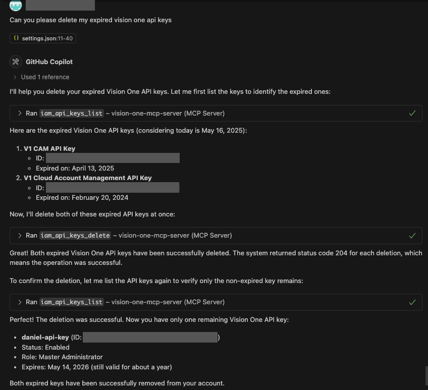
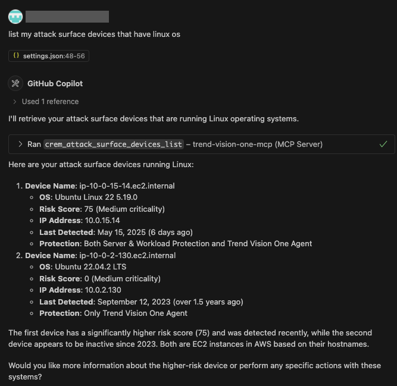

# Trend Vision One MCP Server

The Trend Vision One Model Context Protocol (MCP) Server enables natural language interaction between your favourite AI tooling and the Trend Vision One web APIs.

This allows users to harness the power of Large Language Models (LLM) to interpret and respond to security events.

## Example Use Cases

1. Automating the retrieval and interpretation of security alerts from various Trend Vision One such tools as Workbench, Cloud Posture, and File Security.
2. Allowing LLMs to gather information about security events and generate meaningful recommendations.
3. Automating workflows to enhance the configuration of Trend Vision One services.
4. Interacting with Trend Vision One web APIs without having to learn yet another company's APIs.

## Security

1. Your Trend Vision One API keys should be configured with minimial permissions.
2. By default the MCP server runs in read-only mode. Be careful when running the server with `readonly=false` as it may have irreversible consequences.
3. Data retrieved using the MCP server is processed by the LLM configured in your AI tooling. It is your responsibility to ensure that this LLM is approved by your company for processing sensitive data.
4. This MCP server is only intended to be used with local integrations and command-line tools via the Standard Input/Output transport. You should never expose this tool to the network.

## Getting Started

### Prerequisites

1. You must have a Trend Vision One account and API key.
2. You must have credits allocated for the services you wish to interact with.
3. Have [Go](https://go.dev/doc/install) installed.

### Installation

```bash
go install github.com/trendmicro/vision-one-mcp-server/cmd/v1-mcp-server@latest
```

### Manual Installation Steps

1. Clone the repository.
2. Compile the binary `go build -o ./bin/v1-mcp-server ./cmd/v1-mcp-server/main.go`.
3. Move the binary onto your `$PATH`.
4. Run the binary.

### Use With VSCode + GitHub Copilot

Click [this link](https://insiders.vscode.dev/redirect/mcp/install?name=trend-vision-one-mcp&inputs=%5B%7B%22id%22%3A%22trend-vision-one-api-key%22%2C%22type%22%3A%22promptString%22%2C%22description%22%3A%22Trend%20Vision%20One%20API%20Key%22%2C%22password%22%3Atrue%7D%5D&config=%7B%22command%22%3A%22v1-mcp-server%22%2C%22args%22%3A%5B%22-region%22%2C%20%22au%22%2C%20%22-readonly%3Dtrue%22%5D%2C%22env%22%3A%7B%22TREND_VISION_ONE_API_KEY%22%3A%22%24%7Binput%3Atrend-vision-one-api-key%7D%22%7D%7D) to install the VSCode configuration or add the configuration below to your `settings.json`.

```json
{
    "mcp": {
        "inputs": [
            {
                "type": "promptString",
                "id": "trend-vision-one-api-key",
                "description": "Trend Vision One API Key",
                "password": true
            },
        ],
        "servers": {
            "trend-vision-one-mcp": {
                "command": "v1-mcp-server",
                "args": [
                    "-region",
                    "au",
                    "-readonly=true"
                ],
                "env": {
                    "TREND_VISION_ONE_API_KEY": "${input:trend-vision-one-api-key}"
                }
            }
        }
    },
}
```

### Server Options

| Option | Description |
| ------ | ----------- |
| `-readonly` | Specify whether or not the server should run in readonly mode `readonly=true`, `readonly=false`. Default `true`. |
| `-region` | Specify the Trend Vision One region. Regions are: `au`, `jp`, `eu`, `sg`, `in`, `us` or `mea`. |
| `-host` | Set the Trend Vision One endpoint you want to use. Useful for interacting with internal environments. |

## Tools

### Cloud Posture

| Tool | Description | Mode |
| ---- | ----------- | ---- |
| `cloud_posture_accounts_list` | List CSPM Accounts. | `read` |
| `cloud_posture_account_checks_list` | List the checks of an account. | `read` |
| `cloud_posture_account_scan` | Start scanning Cloud Posture account. | `write` |
| `cloud_posture_account_scan_settings_get` | Get the scan settings for an account. | `read` |
| `cloud_posture_account_scan_settings_update` | Update an account's scan settings. | `write` |
| `cloud_posture_template_scanner_run` | Scan an infrastructure as code template using the cloud posture template scanner. | `read` |

### Identity and Access Management (IAM)

| Tool | Description | Mode |
| ---- | ----------- | ---- |
| `iam_api_keys_list` | List Vision One API Keys. | `read` |
| `iam_api_keys_delete` | Delete Vision One API Keys. | `write` |
| `iam_accounts_list` | Displays users, groups, and invitations in the account. | `read` |
| `iam_account_invite` | Sends an invitation to the specified email address to be added as an account. | `write` |
| `iam_account_update` | Updates the specified account. | `write` |
| `iam_account_delete` | Deletes the specified account. | `write` |

### Workbench

| Tool | Description | Mode |
| ---- | ----------- | ---- |
| `workbench_alerts_list` | List Trend Vision One Workbench Alerts. | `read` |
| `workbench_alert_detail_get` | Displays information about the specified alert. | `read` |
| `workbench_observed_attack_techniques_list` | List observed attack techniques. | `read` |

### Cyber Risk & Exposure Management (CREM)

| Tool | Description | Mode |
| ---- | ----------- | ---- |
| `crem_attack_surface_devices_list` | List discovered attack surface devices. | `read` |
| `crem_attack_surface_domain_accounts_list` | List discovered attack surface domain accounts. | `read` |
| `crem_attack_surface_service_accounts_list` | List discovered service accounts. | `read` |
| `crem_attack_surface_global_fqdns_list` | List discovered internet facing domains (Fully Qualified Domain Names). | `read` |
| `crem_attack_surface_public_ips_list` | List discovered public IP addresses. | `read` |
| `crem_attack_surface_cloud_assets_list` | List discovered cloud assets. | `read` |
| `crem_attack_surface_high_risk_users_list` | List high risk users. | `read` |
| `crem_attack_surface_cloud_asset_profile_get` | Get a cloud asset's profile. | `read` |
| `crem_attack_surface_cloud_asset_risk_indicators_list` | List a cloud asset's risk indicators. | `read` |
| `crem_attack_surface_local_apps_list` | List discovered local applications. | `read` |
| `crem_attack_surface_local_app_profile_get` | Get a local app's profile. | `read` |
| `crem_attack_surface_local_app_risk_indicators_list` | List a local app's risk indicators. | `read` |
| `crem_attack_surface_local_app_devices_list` | Displays the devices with the specified local application installed. | `read` |
| `crem_attack_surface_local_app_executable_files_list` | Displays the local applications installed executable files. | `read` |
| `crem_attack_surface_custom_tags_list` | List tag definitions. | `read` |

### Cloud Account Management (CAM)

| Tool | Description | Mode |
| ---- | ----------- | ---- |
| `cam_alibaba_account_get` | Get the details of an Alibaba account managed by Cloud Account Manangement. | `read` |
| `cam_alibaba_accounts_list` | Displays all Alibaba Cloud accounts connected to Trend Vision One in a paginated list. | `read` |
| `cam_aws_accounts_list` | List AWS accounts managed by Cloud Account Management. | `read` |
| `cam_aws_account_get` | Get the details of an AWS account managed by Cloud Account Management. | `read` |
| `cam_gcp_accounts_list` | List Google Cloud Projects managed by Cloud Account Management. | `read` |
| `cam_gcp_account_get` | Get the details of a GCP project managed by Cloud Account Manangement. | `read` |

### Email Security

| Tool | Description | Mode |
| ---- | ----------- | ---- |
| `email_security_accounts_list` | Returns all email accounts managed by an email protection solution or with email sensor detection enabled. | `read` |
| `email_security_domains_list` | Returns all email domains managed by an email protection solution. | `read` |
| `email_security_servers_list` | Returns all email servers managed by an on-premises email protection solution. | `read` |

### Container Security

| Tool | Description | Mode |
| ---- | ----------- | ---- |
| `container_security_ecs_clusters_list` | Displays all registered Amazon Elastic Container Service (ECS) clusters in a paginated list | `read` |
| `container_security_image_vulnerabilities_list` | Displays the container image vulnerabilities detected in Kubernetes and Amazon ECS clusters for your account | `read` |
| `container_security_k8_cluster_get` | Displays the details of the specified Kubernetes cluster | `read` |
| `container_security_k8_clusters_list` | Displays all registered Kubernetes clusters | `read` |
| `container_security_k8_images_list` | Displays the Kubernetes images that are running in all clusters for your account | `read` |

### Endpoint Security

| Tool | Description | Mode |
| ---- | ----------- | ---- |
| `endpoint_security_agent_update_policies_list` | Displays the available agent update policies | `read` |
| `endpoint_security_endpoint_get` | Displays the detailed profile of the specified endpoint | `read` |
| `endpoint_security_endpoints_list` | Displays a detailed list of your endpoints | `read` |
| `endpoint_security_task_get` | Displays the status of the specified task | `read` |
| `endpoint_security_tasks_list` | Displays the tasks of your endpoints in a paginated list | `read` |
| `endpoint_security_version_control_policies_list` | Displays your Endpoint Version Control policies | `read` |

## Architecture


## Examples

### Start a Scan With Cloud Posture


### Domain Account Analysis


### Deleting Expired Trend Vision One API Keys



### Filtering Attack Surface Devices



## Change Log

See [releases](https://github.com/trendmicro/vision-one-mcp-server/releases/).

## Contibuting

Please see the [contributing](./CONTRIBUTING.md) guide.

## Code of Conduct

This project adopts the [Go Code of Conduct](https://go.dev/conduct).
